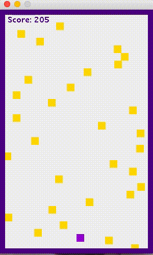

# Hero Game

Really simple game to practice Java GUIs.



### Rules

Dodge the falling, fast moving yellow squares! You can use the left/right keys or the A/D keys to move. You gain points by staying alive.

### Installation

1. Download directory

2. Run on Mac Terminal

(Instead of manually typing out the path to your directory you can just drag the folder into your terminal)

```
cd /path/to/hero-game
javac HeroGameGUI.java
java HeroGameGUI
```